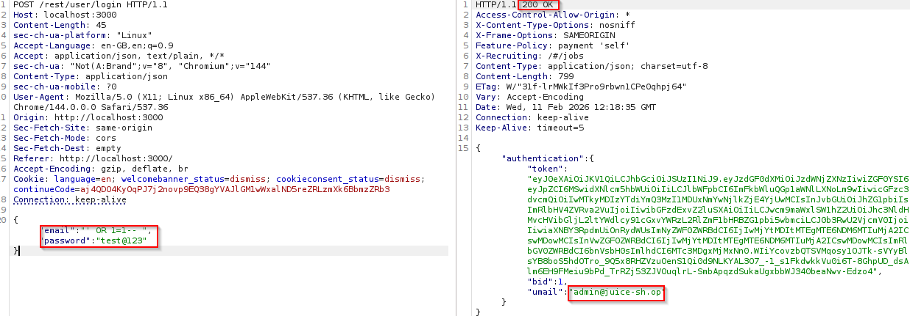
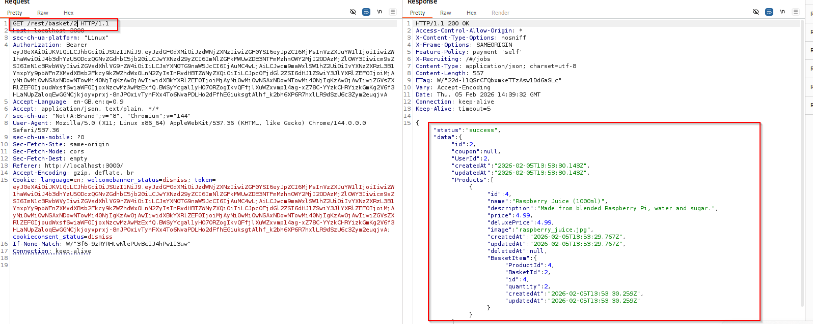
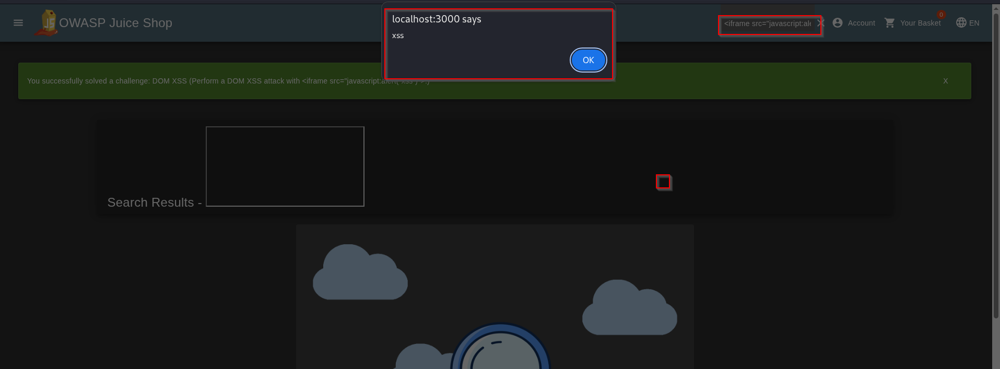

# Comprehensive VAPT Report: OWASP Juice Shop
**Analyst:** Hemesh CR  | **Target:** JuiceShop v14.0 (Vulnerable Test Bed Environment)

## 1. Executive Summary
This report details a professional Vulnerability Assessment and Penetration Test (VAPT) on the OWASP Juice Shop application. I identified 6 key security flaws that pose significant risks to business operations, customer data privacy, and financial integrity.

---

## 2. Technical Findings

### Finding 1: SQL Injection (Authentication Bypass)
- **Severity:** **Critical**
- **Description:** Using the payload `' OR 1=1--`, I bypassed the login screen to gain administrative access without a password.
- **Business Impact:** Full database access. Attackers can steal customer lists or delete inventory.
- **Evidence:** 

### Finding 2: Broken Authentication (Credential Brute Force)
- **Severity:** **High**
- **Description:** The login form lacks rate-limiting. I used Burp Suite to identify the password `admin123` via automated guessing.
- **Business Impact:** High risk of account takeover and fraudulent orders.
- **Evidence:** 

### Finding 3: Insecure Direct Object Reference (IDOR via API)
- **Severity:** **High**
- **Description:** By changing the ID in the API request `/rest/basket/2`, I was able to view private baskets of other customers.
- **Business Impact:** Violation of GDPR and customer privacy laws. 
- **Evidence:** 

### Finding 4: Reflected Cross-Site Scripting (XSS)
- **Severity:** **Medium**
- **Description:** The search bar allows the execution of malicious scripts via an `<iframe>` payload.
- **Business Impact:** Can be used to hijack user sessions or steal login cookies.
- **Evidence:** 

### Finding 5: Improper Error Handling (Information Leakage)
- **Severity:** **Medium**
- **Description:** Requesting invalid paths returns a "Stack Trace" revealing the server's internal folders and software versions.
- **Business Impact:** Provides a technical "map" for attackers to plan more advanced exploits.
- **Evidence:** 

### Finding 6: Security Misconfiguration (Directory Listing)
- **Severity:** **Low/Medium**
- **Description:** The `/ftp` directory is publicly accessible, showing internal backup files.
- **Business Impact:** Exposes internal company data and sensitive developer notes.
- **Evidence:** 

---

## 3. Remediation Summary
1. **Parameterized Queries:** To stop SQL Injection.
2. **Account Lockout/MFA:** To stop Brute Force attacks.
3. **Server-Side Authorization:** To ensure users only see their own data.
4. **Input Sanitization:** To stop XSS scripts.
5. **Generic Error Pages:** To prevent information disclosure.
